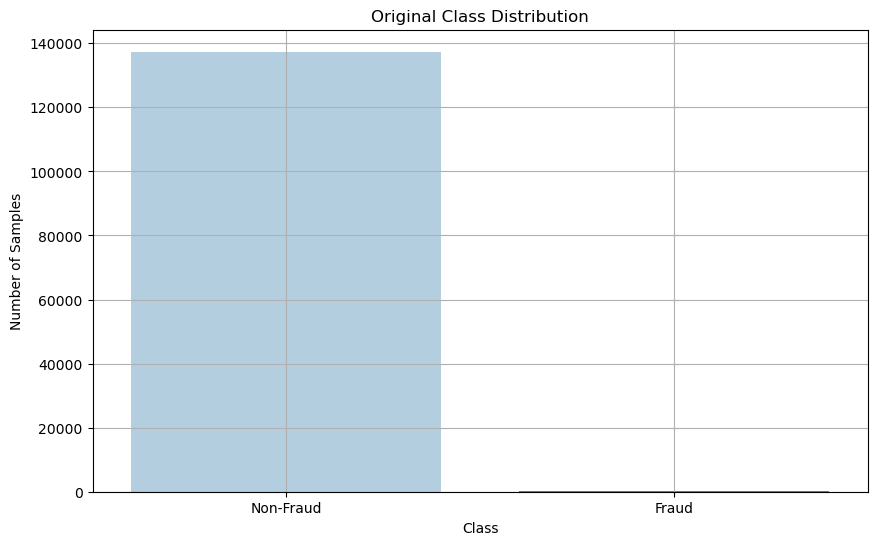
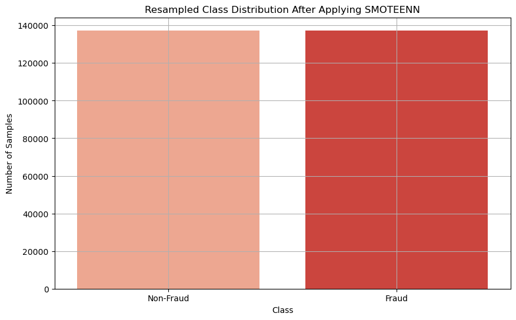
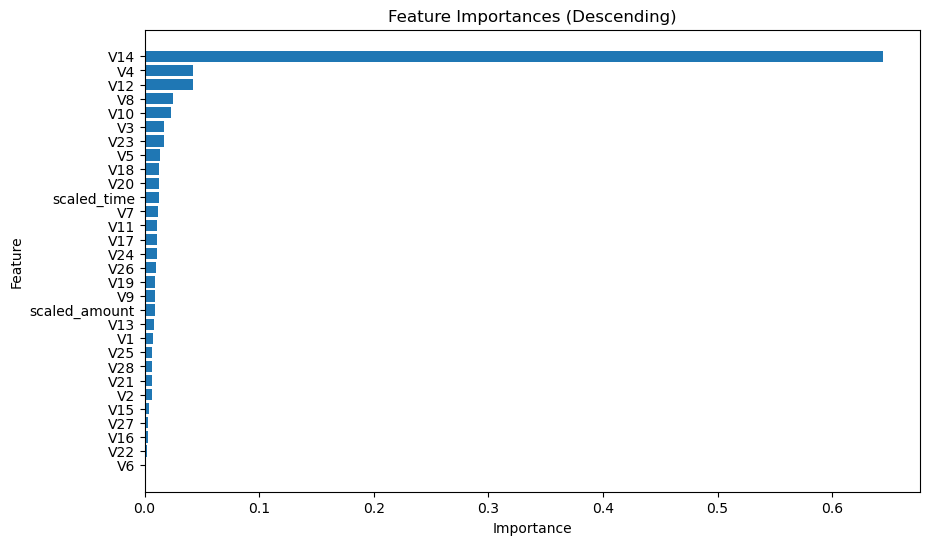
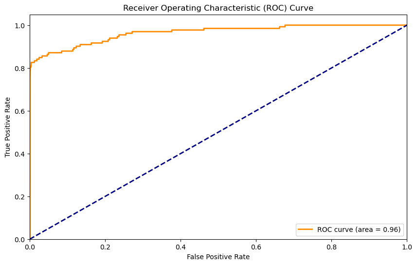

# Project_2 Credit Card Fraud

Credit card fraud is a form of identity theft in which an individual uses someone else's credit card information to charge purchases, or to withdraw funds from the 
account. Credit card fraud also includes the fraudulent use of a debit card, and may be accomplished by the theft of the actual card, or by illegally obtaining the 
cardholder's account and personal information, including the card number, the card's security number, and the cardholder's name and address. Policing agencies from 
the local police department, to the U.S. Secret Service are on the job enforcing fraud laws as they related to credit card fraud.

Nowadays, credit and debit card transactions are more common than cash in the United States. This gives digital criminals all the opportunity they could want to commit
credit card fraud. And every year, they succeed at least some of the time with 52 million Americans experiencing credit card fraud last year. Credit card security has 
become increasingly critical as the U.S. and other countries edge towards becoming a cashless economy. American consumers rely heavily on credit cards, supplying 
fraudsters with a steady stream of potential targets. Four out of five American adults today possess at least one credit card, and three of five cardholders have 
experienced unauthorized charges - an estimated 128 million victims. Seventy-five percent of those victims said they've had credit card fraud more than once.

Americans use credit or debit cards to make 60 percent of their payments, and that proportion is steadily rising. This continuing march towards a cashless 
society may reduce violent crime and corruption while elevating convenience but also expanding opportunities for fraud.  128 million Americans have been victimized by 
credit card fraud, 52 million in the last year alone — more than 90 percent of those crimes employed remote technology without access to a physical card. 
Positive practices (billing reviews, card notifications, credit monitoring, and multi-factor authentication) improve financial safety but can be undone by risky 
consumer habits (poorly managed credentials, insecure networks, comingling of disparate card uses).  As more cardholders embrace digital wallets and institutions 
turn to artificial intelligence and quantum connections for next-gen security measures, the number of victims may decline. Unfortunately, criminals often adapt and 
stay one step ahead, so all credit card users should remain vigilant.

Finally,top 5 fraud trends for 2024 are as follows: 
1. Synthetic identity fraud remains the most common form of identity theft. In 2024, criminals are expected to continue exploiting weak IT protocols, setting up fake 
investment websites, targeting e-commerce businesses, and carrying out social engineering scams like phishing, smishing, and vishing. Synthetic identity fraud, which 
includes the use of stolen data, is predicted to remain the most common form of identity theft. 

2. The use of AI-based attack vectors
Artificial intelligence (AI) is increasingly being used by criminals to commit fraud, launch attacks against individuals and businesses, and illegally access the global 
financial system. In recent years, AI has been associated with inciting terror attacks, creating deepfakes for extortion, carrying out corporate espionage, and 
disseminating child sexual abuse material (CSAM). 

3. The rise in fraud-as-a-service
Once a criminal has found a use for AI, it can be easily shared, replicated, and sold, creating “crime-as-a-service” models. Fraud-as-a-service (FaaS) is one such model, 
where cyber criminals offer fraud-related tools and operations to individuals who do not have the technical expertise to commit fraud themselves. Instead of utilizing 
dark web marketplaces, scammers are increasingly relying on deep web messaging apps, like Telegram to maintain anonymity. In one scheme Telegram uncovered in 2021, cyber 
criminals received crypto payments in exchange for using stolen credit card details to purchase meals from various restaurants and have them delivered to the buyer’s 
location.

4. Contactless fraud rises
According to Juniper Research, the number of people using contactless mobile payments will reach 1 billion by 2024, rising from 782 million in 2022. This includes tapping 
cards, smartphones, and digital wallets offered by providers such as GooglePay, ApplePay, and wearable devices. With the proliferation of devices with near-field 
communications (NFC) technology, the use of mobile phones for accepting payments is expected to keep growing. In fact, it is anticipated that by 2027, transactions 
associated with contactless payments will amount to $10 trillion.

5. Pig butchering emerges as a top payment threat
According to Visa’s Spring 2024 edition of its Biannual Threats Report, pig butchering scams have emerged as one of the top four payment threats against consumers. In 
these schemes, fraudsters search dating and social media sites for victims and create fake accounts to interact with them. The objective is to gain the victim’s trust 
and become their “lover” or “friend”. The scammer may even pretend to be a long-lost contact of the victim.

### XGBoost model achieved a high level of accuracy and a significant improvement in precision for fraud detection.

- **Overall Accuracy: 0.9993026**
- **Precision for Fraud (Class 1): 0.8**
- **Recall for Fraud (Class 1): 0.85**
- **f1-Score (Class 1): 0.82**
  
With these impressive metrics, the XGBoost model proves to be highly effective in catching fraud cases while maintaining a minimal rate of false positives. This ensures enhanced security and reliability in fraud detection.

Accuracy: 0.9992813861263163
Classification Report:
              precision    recall  f1-score   support

           0       1.00      1.00      1.00    112585
           1       0.66      0.79      0.72       132

    accuracy                           1.00    112717
   macro avg       0.83      0.89      0.86    112717
weighted avg       1.00      1.00      1.00    112717

Accuracy: 0.9987797082921727
Classification Report:
              precision    recall  f1-score   support

           0       1.00      1.00      1.00     34352
           1       0.64      0.85      0.73        66

    accuracy                           1.00     34418
   macro avg       0.82      0.92      0.86     34418
weighted avg       1.00      1.00      1.00     34418

References
1).  Gabriel Preda (2024) Credit Card Fraud Detection Predictive Models. https://www.kaggle.com/code/gpreda/credit-card-fraud-detection-predictive-models
2).  Brett Cruz(2024, Jul 26) 52 Million Americans Experienced Credit Card Fraud Last Year. Securiety.org
3).  RandomForrestClassifier, http://scikit-learn.org/stable/modules/generated/sklearn.ensemble.RandomForestClassifier.html
4).  ComplyAdvantage.Top 5 fraud trends in 2024 and how to mitigate them https://complyadvantage.com/insights/top-fraud-trends/#.